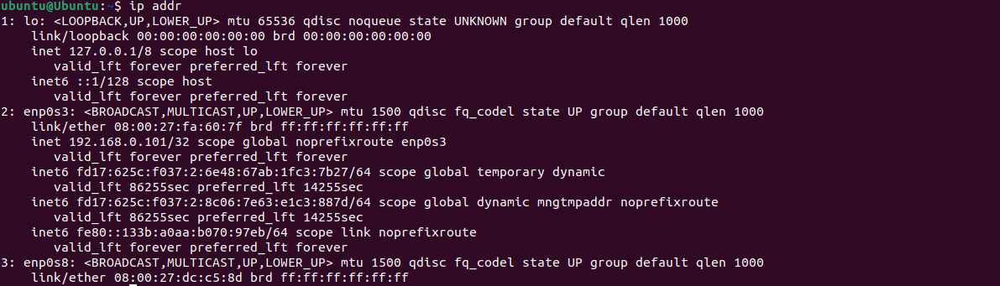

## System Planning and Distribution Selection 


For this week, I set up a small virtualized environment consisting of two virtual machines: a Fedora Server and an Ubuntu Workstation (client), following mainly the Oracle's VirtualBox tutorial [[3]](/references.md). Both machines run inside Oracle VirtualBox on a Windows host system and are connected through a NAS interface and a bridged adapter, which connects the VMs to the same physical network as the host, using the host’s Intel(R) Wi-Fi 6 AX201 160MHz interface.
This type of setup will make sure that the communication between systems will happen mainly through a static IP with *SSH* and will ensure a stable workstation.

> In this journal's section you may find the documentation covering the system architecture, distribution decisions, workstation selection, and network configuration.

&nbsp;

*The diagram shown below describes the system architecture.*


- *Server*: Fedora Linux server distribution (Virtual Machine)
- *Client* (Workstation): Ubuntu Linux distribution (Virtual Machine)
- *Physical Machine (Host)* - Windows personal computer. Provides the WLAN connection through the VirtualBox bridged adapter 


&nbsp;

---
### > Operating System Selection

I chose Fedora Server for the server side due to the fast, reliable performance and strong security defaults with no bloatware. Fedora has newer Linux kernels and server components, which is ideal for experimenting with modern features, additionally, SELinux is enforced by default, providing better out-of-the-box protection [[4]](/references.md).

| Distribution    | Pros                                                                  | Cons                                             |
|-----------------|-----------------------------------------------------------------------|--------------------------------------------------|
| Fedora (chosen) | Fast performance, SELinux enforced, strong security, frequent updates | Shorter support cycle due to newer kernel        |
| Ubuntu          | Very long-term support, large community, easier package availability  | Uses AppArmor instead of SELinux, slower updates |
| Debian          | Extremely stable, minimal issues                                      | Slow release cycle                               |


I selected Ubuntu Desktop as the client (workstation) because it is widely used in education and professional environments, most guides and tools support Ubuntu, it works smoothly with VirtualBox and hardware drivers and it is ideal for testing client–server interactions.

> I did considered alternatives such as Fedora for the client, with its modern and polished look, but uses GNOME heavily and updates aggressively.
Alternatively, Linux Mint has good usability but less commonly used in enterprise environments.


&nbsp;

Both VMs are configured using VirtualBox Bridged Adapter mode attached to the host WLAN interface Intel(R) Wi-Fi 6 AX201 160MHz. Both machines will have a static IPs for easier SSH and routing with the following IPs: 
- Server: **192.168.0.100**
- Client (Workstation): **192.168.0.101**

This setup allows both systems to appear as separate devices on the same Wi-Fi network, enabling ping, SSH, and file transfer across the two virtual machines.


&nbsp;

Below you can find the setup I used for the assignment of a Static IP Address.
```bash
# Specify address
sudo nmcli connection modify "enp0s3" ipv4.addresses 192.168.0.100/24
# Define gateway (can skip)
sudo nmcli connection modify "enp0s3" ipv4.gateway 192.168.0.1
# Setup dns (can skip)
sudo nmcli connection modify "enp0s3" ipv4.dns "8.8.8.8"
# Define the connection method as manual, so that it does not change automatically
sudo nmcli connection modify "enp0s3" ipv4.method manual
# Restart connection
sudo nmcli connection down "enp0s3"
sudo nmcli connection up "enp0s3"
```
*I had some issues setting up each machine as I did not know the ipv4 gateway of the host machine (192.168.0.1), and I override it with 192.168.1.1. By using `ipconfig` in window's *CMD*, I was able to find it in "Default Gateway" and this solved any connectivity issues.*


&nbsp;

---
### > Linux Commands

Finally, I collected system information from both VMs using standard Linux commands:

```bash
uname -a
```
> `uname` prints information about the system’s kernel and architecture.
The `-a` flag means “print all available information”.


&nbsp;

```bash
free -h
```
> `free` displays the amount of RAM and swap memory currently in use and available.
`-h` defines the human-readable format (MB/GB instead of bytes)


&nbsp;

```bash
df -h
```
> `df -h` shows disk space usage for all mounted filesystems.
`-h` defines the human-readable format (MB/GB instead of bytes)


&nbsp;

```bash
ip addr
```
> `ip addr` displays detailed information about the system’s network interfaces.




&nbsp;

```bash
lsb_release -a
```
> `lsb_release -a` prints information about the Linux distribution. (Fedora only accepts `cat /etc/fedora-release`)


&nbsp;

*All commands functionalities have been discovered through web searches.*