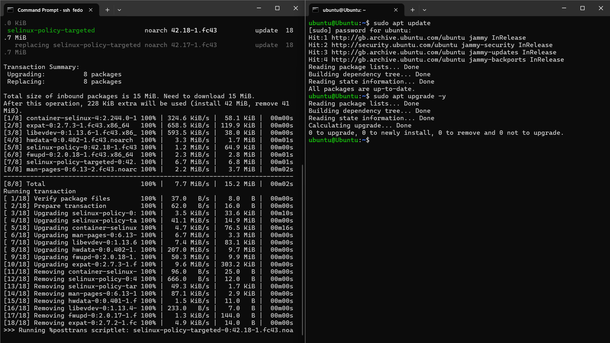
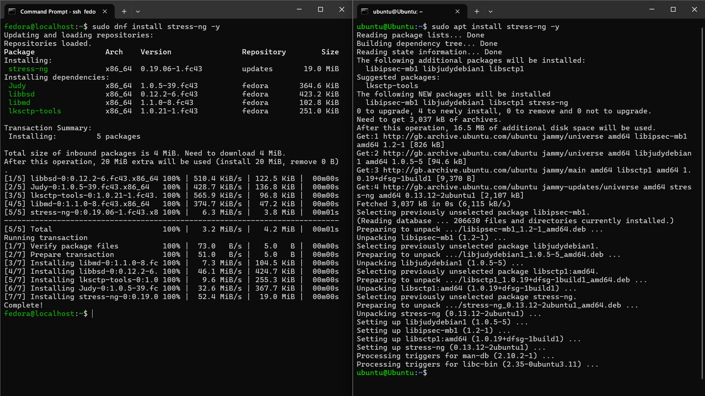
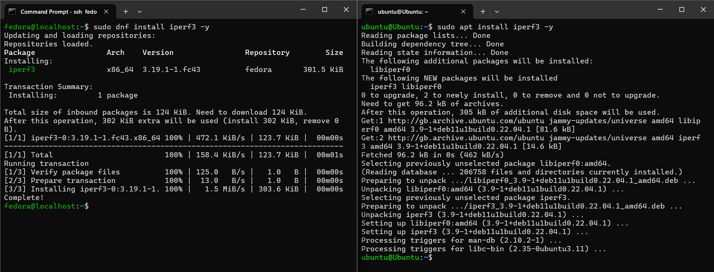

## Application Selection for Performance Testing

To be able to observe CPU, RAM, I/O or network spikes, I decided to use applications dedicated to stress testing [[8]](/references.md), as normal applications such as web browsers or calculators do not fully consume each resource.
Below you may find the application selection matrix, based on researching the web.

&nbsp;

| Workload Type               | Application Selected            | Justification                                                              |
|-----------------------------|---------------------------------|----------------------------------------------------------------------------|
| *CPU-Intensive*             | `stress-ng`                     | Creates heavy computational load for controlled CPU stress testing         |
| *RAM-Intensive*             | `stress-ng` with `--vm` workers | Allocates a specified amount of memory                                     |
| *I/O-Intensive*             | `dd` or `stress-ng` with `-io`  | Tests disk read/write throughput and block performance                     |
| *Network-Intensive*         | `iperf3`                        | Measures upload/download throughput and network latency                    |
| *Server/Hosted Application* | `nginx` web server              | Lightweight server for request handling and network responsiveness testing |

---
&nbsp;
### > Installation Documentation (SSH Commands)


All applications have been installed remotely via SSH connection through Windows' *CMD* logged in as both machines:

```bash
ssh fedora@192.168.0.100
ssh ubuntu@192.168.0.101
```

> Ubuntu installation

```bash
# System update
sudo apt update
sudo apt upgrade -y
# Stress testing suite
sudo apt install stress-ng -y
# Network benchmark tool
sudo apt install iperf3 -y
```

> Fedora installation

```bash
# System update
sudo dnf update -y
# Stress testing suite
sudo dnf install stress-ng -y
# Network benchmark tool
sudo dnf install iperf3 -y
```
&nbsp;

Following the above commands, I updated both VMs (this can be done between VMs as well)

*Install stress-ng*

*Install iperf3*



---
&nbsp;
### > Expected Resource Profiles

To make sure that I understand how these applications behave, I created a table showing the command together with their respective expected resource usage.

&nbsp;

| Application                                  | Expected CPU Usage | Expected RAM Usage | Expected Disk I/O | 
|----------------------------------------------|--------------------|--------------------|-------------------| 
| `stress-ng --cpu 7`                          | Very High          | Low/Medium         | Minimal           | 
| `stress-ng --vm 2 --vm-bytes 5G`             | Low CPU            | High RAM usage     | Minimal           | 
| `dd if=/dev/zero of=testfile bs=3G count=40` | Low                | Low/Medium         | Very High         | 
| `iperf3 -s` / `iperf3 -c 192.168.0.100:101`  | Medium             | Low                | Medium/High       |

---
&nbsp;
### > Monitoring Strategy

Each application will be monitored through its associated tool. The tool will be used by the respective machine (Eg. The server is being stress-tested and the client is observing spikes) and every spike, together with base operating values, will be recorded via screenshots shown in [week 6](/week6.md).

&nbsp;

| Test            | Tools Used                  | Metrics Collected                      |
| --------------- |-----------------------------|----------------------------------------|
| CPU Stress Test | `htop`, `nmon`, `top`       | CPU %, load average                    |
| RAM Saturation  | `free -h`, `vmstat`, `htop` | Memory consumption, swap usage         |
| Disk I/O        | `iotop`, `dd`               | Read/write speed (MB/s), I/O wait time |
| Network Test    | `iperf3`                    | Bandwidth (Mbps), latency, packet loss |
