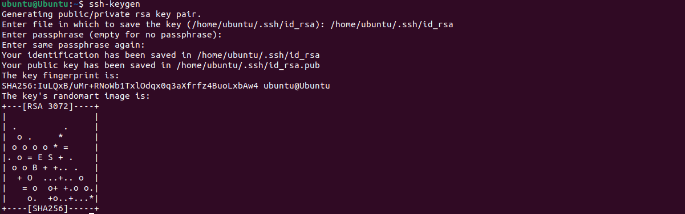
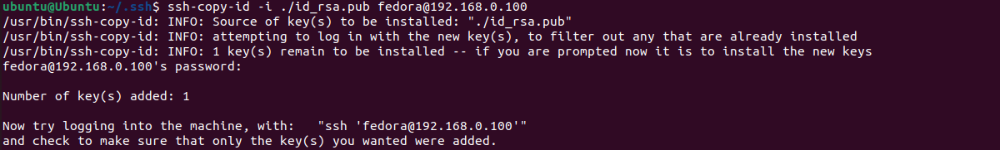
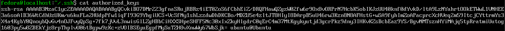
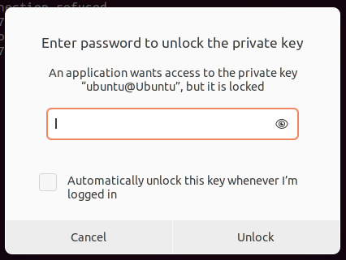
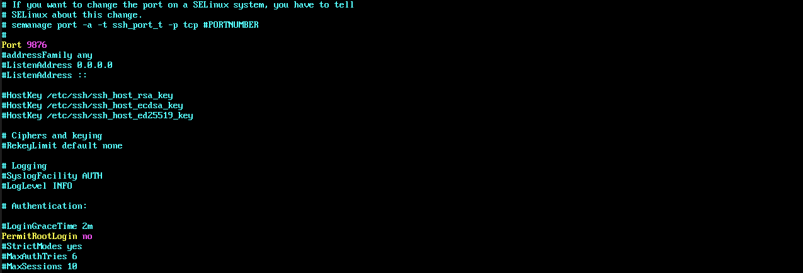
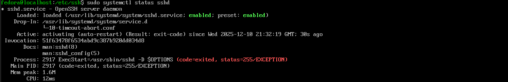
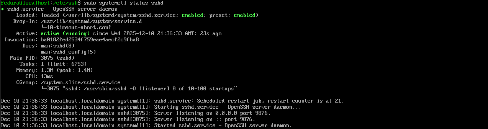
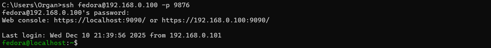
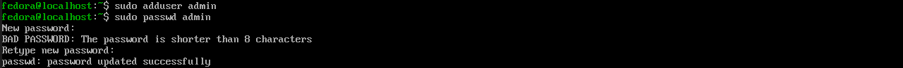
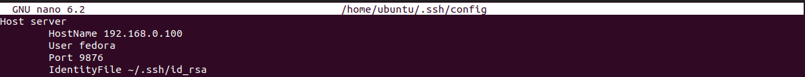

## Initial System Configuration & Security Implementation


This week focuses on setting up *SSH* key-based authentication for easier login, firewall IP filtering so that only the workstation is able to connect via *SSH* and basic user creation / sudoers escalation.
> Most of the following commands have been introduced in [week 2](/week2.md) in the *System Hardening checklist*.

&nbsp;

### > SSH with key-based authentication

To create a key authentication, I first run `ssh-keygen`, then I selected the file in which to save the key (defaults to '*home/ubuntu/.ssh/id_rsa*'). Finally, I assigned a custom passphrase.

At this point, `ssh-keygen` will create a private and public key called id_rsa in *home/ubuntu/.ssh/*.



I then head to the *~/.ssh/* folder to confirm the key creation.


It looks like it was created. I then copied the public key to the authorized_keys in the server by using the following command:
```bash
# Copy command - local identity (-l) - location of identity (key) - user@host
ssh-copy-id -l ./id_rsa.pub fedora@192.168.0.100
```





When connecting to the server, *SSH* will prompt for a passcode for the key. After a successful login, no more passwords will be prompted when attempting to connect in the current session (It will ask every time the OS wakes up).




> Note that this is only a one way key, as the password will be requested when connecting from the server to the client.

---
&nbsp;

### > Configure a firewall permitting SSH from one specific workstation only

Generally, configuring a firewall in such a way is only recommended for specific situation when you do not expect any other connections outside from the workstation. To do so, first I headed to *~/etc/ssh/sshd_config* in the server and I have uncommented and modified the *SSH* `Port` from 22 to 9876 (random number) and PermitRootLogin from `prohibit-password` to `no`. 
> This setup is essential to configure the firewall and ensures the refusal of any connections apart from port 9876 with no root login on the *SSH* level.



I changed the firewall settings to only allow 9876, I have tried to remove port 22, but it was already removed.


Below you can find all rulesets of the firewall, as I have changed only the port, no other rule has changed.


Now as there might have been more open ports, I flushed all existing rules and set the default policies to block everything and allow outgoing network.


I tried connecting from the client, but sshd.service was throwing an error, it being a misconfiguration of *sshd_config*,



After properly saving the *sshd_config* file, it restarted and properly started.



I tried connecting to the server with the new port, and it worked (note that a passphrase will be requested again). I tried logging in with port 22, and the connection was refused.


Unfortunately, the host is still able to connect to the server.



As a result, I changed the allowed IP to 192.168.0.101 in *sshd_config* so only the workstation can connect via *SSH* (`*` - everything, `!` - that is not). After restarting the ssh, I tried connecting to the server from the windows host machine, but got an expected permission denied.


---
&nbsp;

### > User and privilege management, creating a non-root administrative user.

As having root as the only user is a security vulnerability, creating users will add a layer of protection.
I added a user with `sudo adduser admin` and set a password with `sudo passwd admin`

At this point Admin is a normal user with no superuser privileges. To grant these privileges, Admin will need to be added to the wheel group (sudoers in Fedora).


---
&nbsp;

As writing the IP address was getting too repetitive, I decided to add an alias to the server host using `nano ~/.ssh/config` using the following commands:

```bash
Host server
    HostName 192.168.0.100
    User fedora
    Port 9876
    IdentityFile ~/.ssh/id_rsa
```


Now, by writing `ssh server`, *SSH* recognises the host and user by looking into config and automatically requests a connection. Thanks to the key setup the server skips any login prompt.

