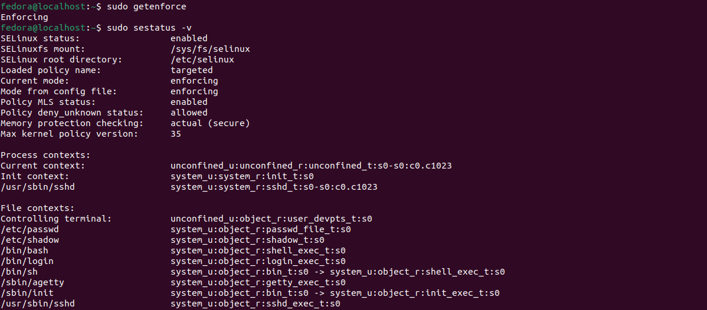
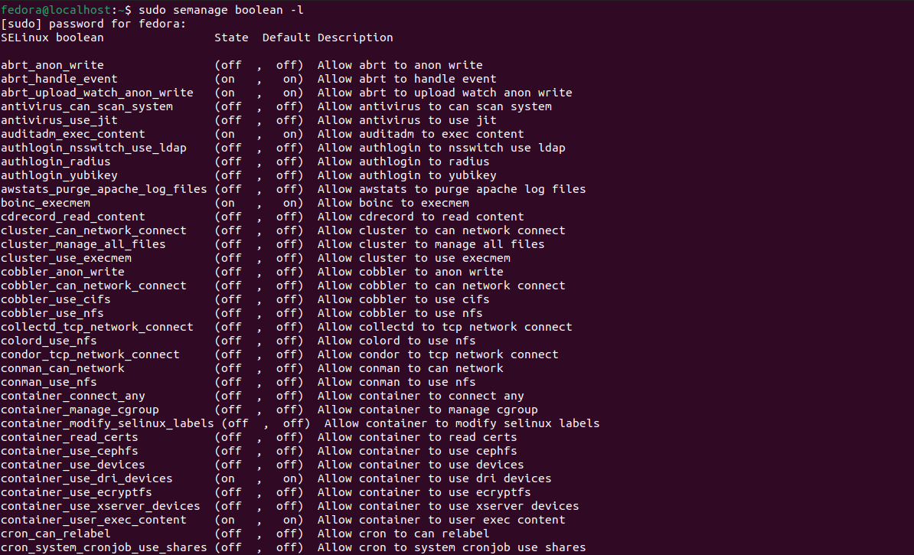
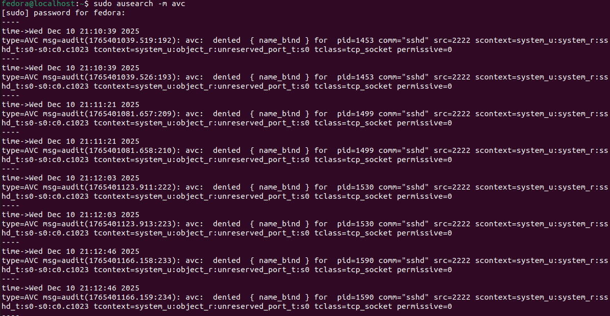
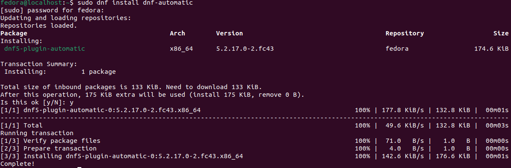
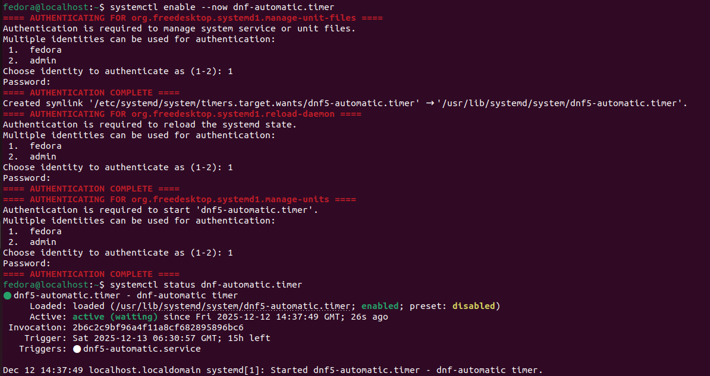
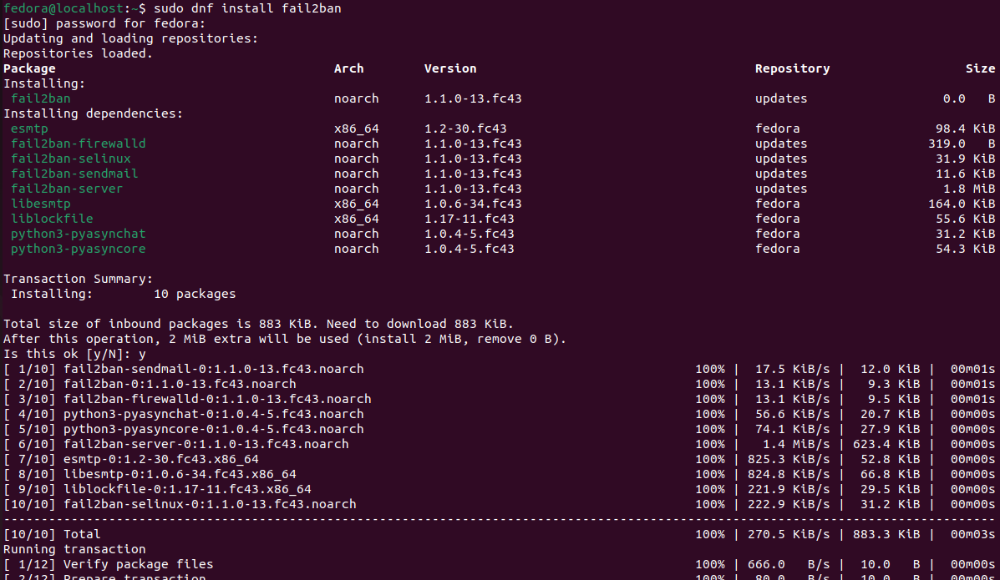
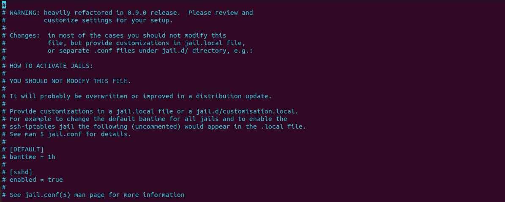
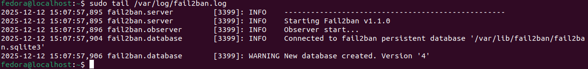
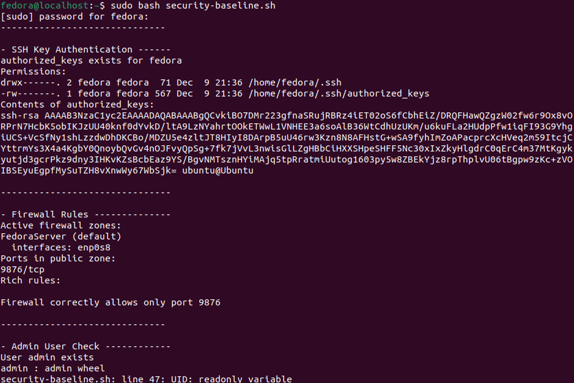
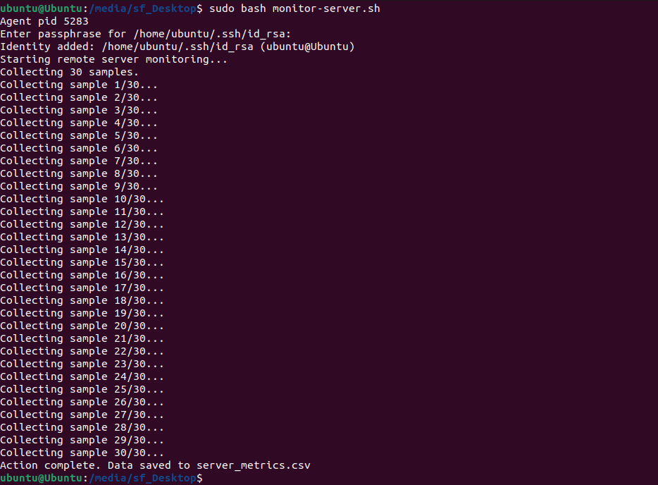

## Advanced Security and Monitoring Infrastructure

In Week 5, I ensured that *SELinux* is properly installed in the server, I setup automatic updates and `fail2ban`. Additionally, I created a bash script that checks if all tools mentioned in this week and [week 4](/week4.md) are properly setup, together with another script that is able to monitor the server collecting performance metrics.

&nbsp;

### > Access control implementation using SELinux

As fedora comes automatically with a MAC (Mandatory Access Control) tool called *SELinux*, there is no need to install it. *SELinux* is a Linux Security Module (LSM) that is built into the Linux kernel. It should not be considered a replacement for antivirus or firewalls, as it is only as a security enhancer [[9]](/references.md).
To be able to detect *SELinux* and all of its enforcements and audit logs:

- I checked SELinux Enforcement Mode using `getenforce` (Enforcing / Permissive / Disabled) [[10]](/references.md).
- `sestatus -v` showed a detailed SELinux status [[10]](/references.md). 



- I used `semanage boolean -l` to display the Boolean values and their descriptions [[10]](/references.md).



- Use `ausearch -m avc` to search in */var/log/audit/audit.log* Access Vector Cache (AVC) messages, which indicate *SELinux* denials [[10]](/references.md).



- To display the context information that's associated with all files in a directory, I used the `ls -Z` command (adding a directory after the command will search only in the specified file / directory) [[10]](/references.md).


- To show the context information that is associated to each process, I used the `ps -Z` command [[10]](/references.md).


---
&nbsp;

### > Automatic security updates

Another major security issue would be the lack of automatic updates. As mentioned in [week 2](/week2.md), a lack of automatic updates can create a window of opportunity for bad actors to abuse vulnerabilities pubicly available online [[7]](/references.md).

&nbsp;

To make sure that the system is always up to date, I installed `dnf-automatic` using `sudo dnf install dnf-automatic` [[11]](/references.md).



Then, I ensured that `dnf-automatic` allows all updates to be downloaded and installed by creating */etc/dnf/automatic.conf* and adding `apply_updates=True`, as by default they are only downloaded. Additionally, I will add `reboot=when-needed` to reboot automatically [[11]](/references.md).


Finally, I executed `dnf-automatic` with `systemctl enable --now dnf-automatic.timer` using *fedora* user [[11]](/references.md) and checked the current status by writing `systemctl status dnf-automatic.timer`.



---
&nbsp;

### > Fail2ban configuration

`Fail2ban` is a service that monitors logfiles to detect potential intrusion attempts and places bans using a variety of methods. In Fedora and EL7, the default firewall service *FirewallD* can be used as a ban action [[12]](/references.md).



To configure `fail2ban`, the main configuration file can be found in */etc/fail2ban/jail.conf*. As this specific file should not be modified directly, a local configuration can be made in */etc/fail2ban/jail.local* [[12]](/references.md).



&nbsp;

As we do not need to configure anything for the time being, we can start the service [[12]](/references.md) with:

```bash
# Start the service
sudo systemctl start fail2ban
# Enable it to run on system startup
sudo systemctl enable fail2ban
# Check if the status of the service
systemctl status fail2ban
```


Finally, each action is logged in */var/log/fail2ban.log*, and it can be read with `tail` [[12]](/references.md).



---
&nbsp;

### > Baseline Verification Script

A baseline verification script is an automated procedure used to validate that a system, application, or configuration is equal to a pre-established "baseline" or reference standard. In my case, I created a script that is able to verify all security configurations mentioned in week 4 and 5 [[13]](/references.md).

```bash
#!/bin/bash
# Tell the system to run this script as bash

# Baseline Security verification script


# Checks SSH key, firewall rules, and admin user

echo "------------------------------"
echo -e "\n- SSH Key Authentication ------"
# Check if the authorized_keys file exists for user 'fedora'
SSH_DIR="/home/fedora/.ssh"
AUTHORIZED_KEYS="${SSH_DIR}/authorized_keys"
if [ -f "$AUTHORIZED_KEYS" ]; then
    echo "authorized_keys exists for fedora"
    echo "Permissions:"
    ls -ld "$SSH_DIR" "$AUTHORIZED_KEYS"
    echo "Contents of authorized_keys:"
    cat "$AUTHORIZED_KEYS"
else
    echo "authorized_keys NOT found for fedora! Key login may fail."
fi

echo -e "\n-------------------------------"
echo -e "\n- Firewall Rules --------------"
# Check if port 9876 is allowed
PORT=9876
# List all firewall rules and check if only this port is allowed
echo "Active firewall zones:"
firewall-cmd --get-active-zones
echo "Ports in public zone:"
firewall-cmd --zone=public --list-ports
echo "Rich rules:"
firewall-cmd --zone=public --list-rich-rules
# Check if port 9876 is the only allowed port, if not, notify user
PORTS=$(firewall-cmd --zone=public --list-ports)
if [[ "$PORTS" == "$PORT/tcp" ]]; then
    echo "Firewall correctly allows only port $PORT"
else
    echo "Firewall allows additional ports! Check rules."
fi

echo -e "\n------------------------------"
echo -e "\n- Admin User Check ------------"


# If User exists
if id "admin" >/dev/null 2>&1; then
    echo "User admin exists"
    groups "admin"
    # Assign User ID
    UID=$(id -u "admin")
    # If admin does not exist
    if [ "$UID" -ne 0 ]; then
        echo "Admin is non-root"
    else
        echo "Admin is UID 0! This is a root-level account."
    fi
else
    echo "User admin does NOT exist!"
fi

# Week 5 baseline verification script
# Generate a readable SELinux report

echo "------------------------------"
# -e for special characters
echo -e "\n- SELinux Status ----------------"
getenforce
sestatus -v

echo -e "\n------------------------------"
echo -e "\n- SELinux Booleans -----------"
semanage boolean -l

echo -e "\n------------------------------"
echo -e "\n- SELinux AVC Denials --------"
sudo ausearch -m avc

echo -e "\n------------------------------"
echo -e "\n- SELinux Directory Contexts -"
ls -Z /etc/selinux

echo -e "\n------------------------------"
echo -e "\n- SELinux Process Contexts ---"
ps -Z 

echo -e "\n------------------------------"
echo "Baseline check complete."
```

This file has been run in the server machine through *SSH*, and is available to download [here](../assets/week5/security-baseline.sh).



---
&nbsp;

### > Monitoring Script

To prepare for [week 6](/week6.md), I created `monitor-server.sh`, an automated script that fetches performance metrics from the server. The script runs from the client and saves data consisting of CPU User Space Usage, CPU System Kernel Space Usage, CPU Idle, Memory Used, Free Memory, Memory Buffers, Disk Read (MB/s), Disk Write (MB/s), Incoming Net Traffic KB/s, Outgoing Net Traffic KB/s, System Load (1m), Disk Read Latency, Disk Write Latency and Network Latency in `server_metrics.csv`. 

&nbsp;

All of these metrics will be used to discover if my expectations mentioned in [week 3](/week3.md) can be proven right, with the addition of performance improvements. Below you can find `monitor-server.sh`, available to download [here](../assets/week5/monitor-server.sh).

```bash
#!/bin/bash
# Tell the system to execute this script as bash.


# monitor-server.sh

# Remote monitoring script that is able to collect CPU, RAM, I/O, Network and Load and write them in a CSV file used for quantitative data collection during stress-testing.
# This specific script works only with enp0s8 interfaces.


# Start a new ssh-agent and export its environment variables, this keeps the agent in memory, removing the need of logging in multiple times.
eval "$(ssh-agent -s)"

# Add the private ssh key to the agent (this will ask for the passphrase once, so that it will not ask for each capture)
ssh-add /home/ubuntu/.ssh/id_rsa


# Variables declaration

# Remote server username
SERVER_USER="fedora"

# Remote server IP
SERVER_IP="192.168.0.100"

# SSH port of the server
SSH_PORT="9876"

# Path to the private SSH key
KEY="/home/ubuntu/.ssh/id_rsa"

# Interval between samples (seconds)
INTERVAL="0"

# Total amount of data collected
SAMPLES="30"

# CSV file name
CSV_FILE="server_metrics.csv"


# CSV initialization, if the CSV file does not exist, create one and add headers
if [ ! -f "$CSV_FILE" ]; then
	echo "Timestamp,CPU_User,CPU_System,CPU_Idle,Mem_Used_MB,Mem_Free_MB,Mem_Buffers_MB,Disk_r/s,Disk_w/s,Disk_rMB/s,Disk_wMB/s,Net_RX_KB/s,Net_TX_KB/s,Load1,Disk_Read_Latency_ms,Disk_Write_Latency_ms,Net_Latency_ms" > "$CSV_FILE"
fi

# Function collect_data collects all metrics (CPU, RAM, I/O, Network and Load)
collect_data() {

	# Use ssh using the key, port and user@ip grouping all commands in a grouped EOF (End Of File for multiline commands) to call them in one sitting. 
	# -i : private key
	# -p : custom port
	ssh -i "$KEY" -p "$SSH_PORT" "$SERVER_USER@$SERVER_IP" bash -s << 'EOF'
	
	# Use high priority for monitoring commands
	# nice: sets CPU scheduling priority (0 = normal priority, as -10 requires root access)
	NICE_CMD="nice -n 0"
	# ionice: sets I/O scheduling priority (class 2 = best-effort, priority 0)
	IONICE_CMD="ionice -c2 -n0"

	# Get date and time
	TS=$(date '+%Y-%m-%d %H:%M:%S')

	# CPU usage (user, system, and idle CPU percentages)
	# Run top twice (-n2) to discard the first reading (as the first reading always throws rubbish data), together with the nice and ionice command.
	# The awk command fetches the first line containing the word Cpu, then split the line by a space, and get the third, fifth and ninth element. (user, system and idle)
	# If no lines have been found, return 0 for each metric.
	CPU=$($NICE_CMD $IONICE_CMD top -bn2 | \
		awk '/Cpu\(s\)/ {line=$0} END {
			if(line){split(line,a," "); 
				print a[2]","a[4]","a[8]
			} else {
				print "0,0,0"
			}
		}')

	# Memory usage (used, free, and buffer/cache memory)
	# , together with the nice and ionice command.
	# Check if Number of Records is equal to two (second line exists). If if does exists, we have data, hence, return the data as pictured below.

	#                total   used   free   shared   buff/cache   available
	# Mem:           7846   2310   3210      112          2325        5200
	# Swap:          2047      0   2047

	MEM=$($NICE_CMD $IONICE_CMD free -m | \
		awk 'NR==2 {
			printf "%s,%s,%s", $3,$4,$6
		} END {
			if(NR<2) print "0,0,0"
		}')


	# Disk I/O (Disk Read (MB/s), Disk Write (MB/s), Disk Read Latency, Disk Write Latency)
	# Find the first non-loop, non-RAM disk device
	# '$3 !~ /loop|ram/' (regex) takes only devices whose name does NOT contain “loop” or “ram”.
	# /proc/diskstats contains a line for every block device, where the regex has effect.
	# Once found, output the device name and exit
	DISK_NAME=$(awk '{if($3 !~ /loop|ram/) {print $3; exit}}' /proc/diskstats)

	# If the file exists
	if [ -n "$DISK_NAME" ]; then
		
		# Search in /proc/diskstats the disk and output its vales
		DISK=$($NICE_CMD $IONICE_CMD awk -v d="$DISK_NAME" '
			$3==d {
				printf "%s,%s,%s,%s",
				$4,$8,$4/1024,$8/1024
			}' /proc/diskstats)

		
		# Total number of read operations completed
		read_ops=$(awk -v d="$DISK_NAME" '$3==d {print $4}' /proc/diskstats)
		# Total number of write operations completed
		write_ops=$(awk -v d="$DISK_NAME" '$3==d {print $8}' /proc/diskstats)
		# Total time spent reading (milliseconds)
		read_ms=$(awk -v d="$DISK_NAME" '$3==d {print $7}' /proc/diskstats)
		# Total time spent writing (milliseconds)
		write_ms=$(awk -v d="$DISK_NAME" '$3==d {print $11}' /proc/diskstats)

		# Initialise latency values
		READ_LATENCY=0
		WRITE_LATENCY=0
		
		# Calculate read latency by dividing operations completed with the time spent writing/reading (if greater than zero -gt 0)
		if [ "$read_ops" -gt 0 ]; then
			# scale=2 tells the calculator to trim to two decimals
			# | bc tells the system to use a floating point calculator
			READ_LATENCY=$(echo "scale=2; $read_ms / $read_ops" | bc)
		fi
		if [ "$write_ops" -gt 0 ]; then
			# scale=2 tells the calculator to trim to two decimals
			# | bc tells the system to use a floating point calculator
			WRITE_LATENCY=$(echo "scale=2; $write_ms / $write_ops" | bc)
		fi
	else
		# No disk has been detected, provide empty values
		DISK="0,0,0,0"
		READ_LATENCY=0
		WRITE_LATENCY=0
	fi

	# Network throughput (RX and TX)
	if [ -n "enp0s8" ]; then
		# Find in /proc/net/dev the interface named "enp0s8", then fetch the second and tenth column (RX and TX). Output both.
		NET=$($NICE_CMD $IONICE_CMD awk -v iface="enp0s8" '
			$1 ~ iface":" {
				rx=$2/1024; 
				tx=$10/1024; 
				print rx "," tx
			}' /proc/net/dev)
	else
		# Network Interface not found.
		NET="0,0"
	fi

	# Network latency (ping localhost)
	# Get the first row from the ping command to localhost (-c1 sends one packet tith a wait time of 1 second (-W1)) to fetch the built-in latency that ping offers.
	NET_LATENCY=$(ping -c1 -W1 127.0.0.1 | awk -F'=' '/time=/{split($4,a," "); print a[1]}')
	if [ -z "$NET_LATENCY" ]; then
		# Ping failed, return zero
		NET_LATENCY=0
	fi

	# Use uptime to fetch a 1-minute load average
	# First awk isolates the data (1m, 5m, 15m). If everything after load average: exists, output it. Else, Output 0
	# The second awk removes spaces commas and fetches only the first element, the 1m one
	LOAD=$(uptime | awk -F'load average:' '{ 
		if($2) print $2; 
		else print "0"}
	' | awk -F',' '{gsub(/ /,""); print $1}')

	echo "$TS,$CPU,$MEM,$DISK,$NET,$LOAD,$READ_LATENCY,$WRITE_LATENCY,$NET_LATENCY"
EOF
}

# ------------------------ MAIN SCRIPT ------------------------
echo "Starting remote server monitoring..."
echo "Collecting $SAMPLES samples."

# For every sample declared earlier
for ((i=1; i<=SAMPLES; i++)); do
	echo "Collecting sample $i/$SAMPLES..."
	# Append metrics to CSV
	collect_data >> "$CSV_FILE"   
	# Sleep for x seconds
	sleep "$INTERVAL"
done

echo "Action complete. Data saved to $CSV_FILE"

```



&nbsp;

As the script has been written in Windows, it returned errors in linux (" : error running command") as Windows saves text with an `\r` at the end of each line. To solve this issues, I made sure to run `dos2unix` before executing the script as it helped convert any artifacts in the script.


There have been some issues with the script not running while under heavy load as well, as the other stress applications were taking all the resources. To combat this, the script includes the `nice` and `ionice` command, both meant to decrease the 'niceness' of the process, hence giving it more priority. To build on it, all commands ran in fedora were given a 'niceness' of 20 (lowest). 

To run `security-baseline.sh` and `monitor-server.sh`, paste the following:
```bash
sudo bash security-baseline.sh

sudo bash monitor-server.sh
```


---
&nbsp;

### > Closing thoughts

In Week 5, I focused on reinforcing the security of the Fedora server using week 5's checklist while preparing for systematic performance monitoring. I verified that SELinux was enforcing mandatory access control, checked Boolean configurations, and reviewed audit logs to ensure proper policy enforcement. I configured automatic updates with dnf-automatic to reduce exposure to known vulnerabilities, and fail2ban was set up alongside FirewallD to detect and block suspicious authentication attempts. To maintain consistency and enable repeat verification, I developed a baseline security script that checks SSH key-based login, firewall rules, SELinux status, and the presence of a non-root administrative user. In parallel, I created a remote monitoring script that logs CPU, memory, I/O, network, and system load metrics to a CSV file, ensuring data collection would not interfere with system performance by using nice and ionice. Overall, Week 5 highlighted the interplay between security and system performance, showing how automated policies, access controls, and monitoring scripts can maintain a hardened, observable environment.