## Performance Evaluation and Analysis

In week 6, I have tested some performance metrics against applications highlighted in [week 3](/week3.md). After planning the test, together with making sure that they have been installed in week 5, I executed the tests by firstly creating a baseline. The tests were conducted in the server through the client to identify performance bottlenecks and potential optimizations.

I ensured that no other applications were running and executed each of the four programs in parallel with monitoring tools and `monitor-server.sh`. 
> Once the data was collected, I would continue with the next application until all applications were monitored on CPU usage, memory usage, disk I/O, network throughput, system latency, and service response times.

---
&nbsp;

### > Monitoring strategy

As mentioned in the introduction, the primary testing methodology for quantitative data has been the output of `monitor-server.sh` (using `/proc`, `top`, `free`, `uptime`, `ping`, and `disk statistics`) created in [week 5](/week5.md). In addition to this monitoring strategy, I decided to visually inspect changes in metrics by running visual monitoring tools such as `htop` ([week 3](/week3.md)).

| Metric                 | Measured with                             |
| ---------------------- |-------------------------------------------|
| CPU usage              | `htop`, `top`, `mpstat`                   |
| Memory usage           | `free -m`, `/proc/meminfo`                |
| Disk I/O performance   | `dd`, `/proc/diskstats`                   |
| Network performance    | `iperf3`, `ping`                          |
| System latency         | `ping`, disk read/write latency           |
| Service response times | Any service-specific response measurement |

*Service response time was calculated using direct latency measurements where available (disk and network) and inferred via scheduler and subsystem latency under CPU and memory load, providing quantitative evidence of system responsiveness degradation under stress.*

> Below I will be listing the baseline tests, together with all other applications, investigating their use description and bottlenecks:

---
&nbsp;

### > Baseline test

To be able to compare each application's metric, I monitored the server with no programs running in the background. I firstly documented all monitoring tools, and then I ran the monitoring script, all the while being connected through ssh.

> `htop`, `nmon` and `top` with no stress in Fedora (server)


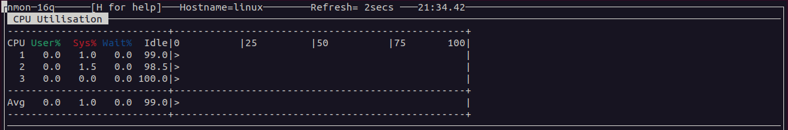


> `free` and `vmstat` with no stress in Fedora (server)


> `iotop` with no stress in Fedora (server)

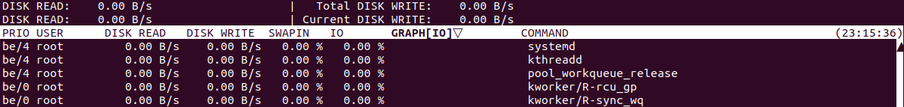

> Metrics from `monitor-server.sh` [[14]](/references.md)

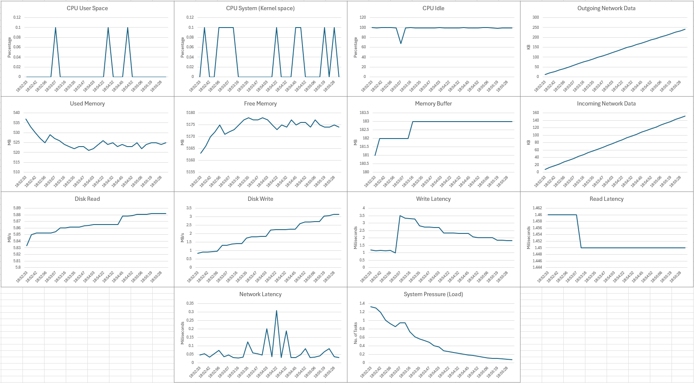

---
&nbsp;

### > Stress-ng (CPU)

I decided to use `stress-ng --cpu 7` to stress test the cpu (7 out of 8 cores) and observe any metric change. The reason for choosing to leave one core was the inability to run anything while all cores were 'hogged' by the application. As mentioned before, `nice` was added in the command to lower the priority.
The monitored metrics would be CPU User Space Usage (average of 0.1%), CPU System Kernel Space Usage (average of 0.3%), CPU Idle (average of 98.23%) and 1-min Load (average of 0.49%) in the baseline monitor output [[14]](/references.md).

The load test consisted of running in full:
```bash
sudo nice -n 20 stress-ng --cpu 7 
```


&nbsp;

As seen in the monitor output [[14]](/references.md) (Shown below), CPU User Space Usage average percentage increased to 46.3%, although as the data is noisy due to the nature of `stress-ng` (and probably the unreliability of my script), the average increases to around 70% if percentages below 9% are ignored. CPU System Usage remains low, with an average of 2.27%, and CPU Idle tanks to an average of 33.94% (with noise). Additionally, 1-min Load increased to 8.82%.

&nbsp;

The main identified bottleneck was the CPU core saturation, but it can be observed that overall almost all the metrics worsen when `stress-ng` is running, confirming my predictions in [week 3](/week3.md). This causes reduced scheduling opportunities for interactive and monitoring processes and increased command execution latency over SSH [[15]](/references.md).
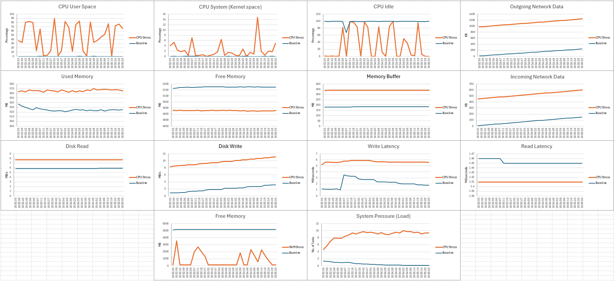

&nbsp;

To optimize the Application, I had to add the `nice` command to modify its priority, as the script gets hold up after `stress-ng`.  Additionally, I decided to force the application to specific cores 0-5 by running `taskset -c 0-5`, together with the original command. This optimization limited the CPU cores utilization, decreasing the CPU User Utilization to 42.1%, a 4.2% decrease from normal usage [[14]](/references.md) - CPU Optimization. Additionally, CPU System utilization dropped to 1.9%, CPU Idle increased to 30.82% and 1-min load decreased to 5.88%, highlighting the effectiveness of limiting CPU cores.
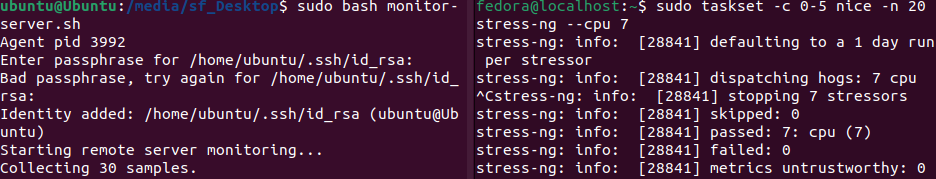

&nbsp;

As shown above, lowering CPU cores for stress workloads improves general responsiveness but slightly reduces maximum CPU throughput. In conclusion, prioritising core limiting over raw CPU throughput is preferable for production environments.

&nbsp;

> Visual representation of `stress-ng --cpu 3` (the cpu had only 3 cores at the time of this test) in Fedora (server), monitored using respectively `htop`, `nmon` and `top` on Ubuntu (client), not used for this specific test.


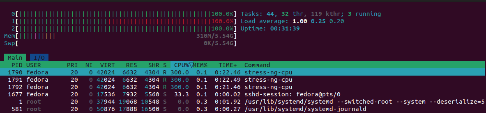
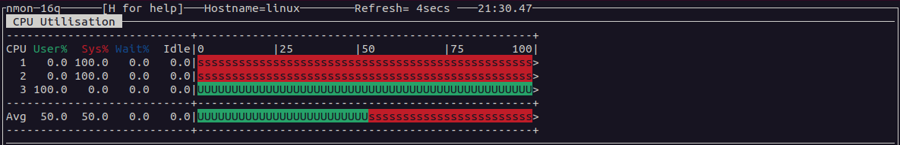


---
&nbsp;

### > Stress-ng (RAM)

I decided to use `stress-ng --vm` to stress test memory usage by allocating 5GB per virtual memory worker. Two workers were used to prevent total memory exhaustion and maintain system responsiveness. The baseline monitored metrics were: Memory Used (average of 525.13MB), Free Memory (average of 5174.17MB) and Memory Buffers (average of 182.7MB) [[14]](/references.md).

The load test consisted of running:
```bash
sudo nice -n 20 stress-ng --vm 2 --vm-bytes 5G
```
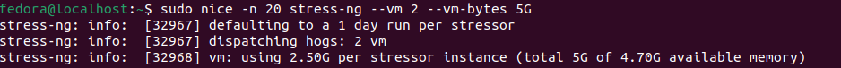
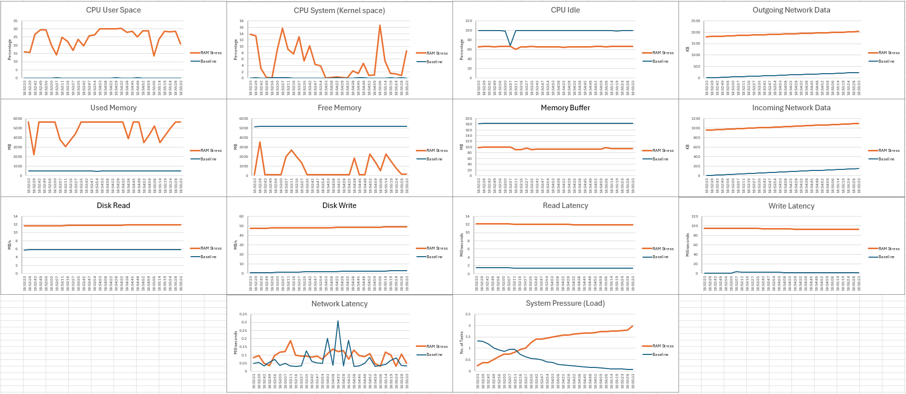

As seen in the monitor output [[14]](/references.md), Memory Used increased by 937% (average of 4924.56MB), and Buffers were heavily reclaimed by the kernel (average of 94.93MB). Additionally, there was no heavy impact on 1-min Load Average, as it rose from 0.49% to 1.29%. 


The main identified bottleneck was physical memory capacity, as the system begins reclaiming cache aggressively to give new allocations (average of 94.93MB), which can impact performance of background processes [[15]](/references.md).

&nbsp;

To optimize the application, I adjusted the OS memory management by lowering the kernel swappiness value using:
```bash
sudo sysctl vm.swappiness=10
```


This prioritises keeping processes in RAM rather than aggressively swapping to disk.

The re-test showed improvements: Memory Used decreased minimally (average of 4876.10MB), Buffers/Caches were better retained (average of 147.7MB) and overall responsiveness improved [[14]](/references.md) - RAM Optimisation.

&nbsp;

Limiting swappiness reduces unnecessary swapping and improves performance for memory-heavy workloads. The trade-off is decreased flexibility under extreme memory pressure, but responsiveness for active applications is maintained.

&nbsp;

> Visual representation of `stress-ng --vm 2 --vm-bytes 1G` in Fedora (server) monitored using respectively `free -h`, `vmstat` and `htop` on Ubuntu (client), not used for this specific test.

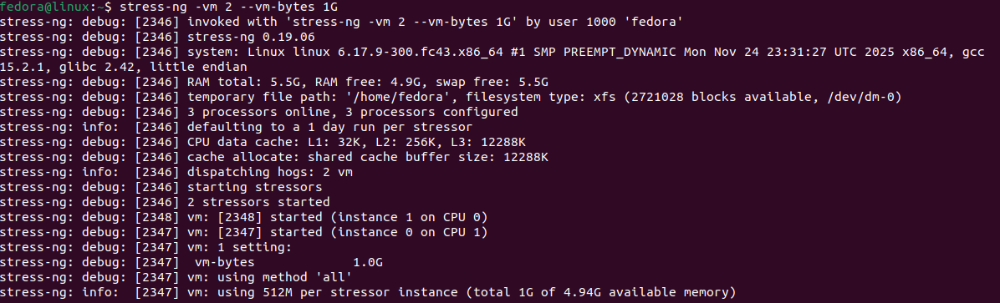


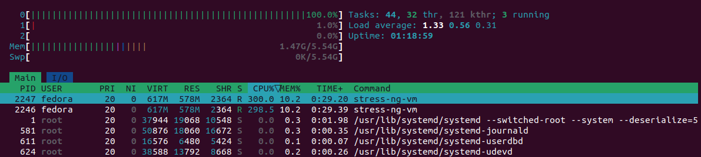

---
&nbsp;

### > dd
I decided to use `dd` to stress the disk with a large write operation.


The goal was to observe the disk throughput and latency under sequential write load. Baseline metrics were: Disk Read/Write Throughput (average of 0.02MB/s), Average Read/Write Latency (0.03ms), CPU Idle (average of 98.23%) and 1-min Load Average (0.49%) [[14]](/references.md).

Below you may find the full `dd` command used to run the tests:

```bash
sudo nice -n 20 dd if=/dev/zero of=testfile bs=3G count=100
```


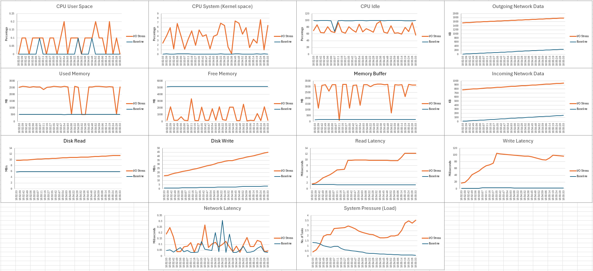

As seen in the monitor output [[14]](/references.md), disk write throughput increased to 30.58MB/s (average), and average Read/Write latency rose to 44ms. CPU remained mostly idle (27.12% Utilization), indicating the disk is the limiting factor (partly due to the size). 1-min Load Average increased to 2.2% [[14]](/references.md).

The main bottleneck was disk write throughput and latency, as the sequential writes fully saturate the I/O channel.

&nbsp;

To optimize, I changed the disk I/O scheduler to mq-deadline for predictable latency:

```bash
echo mq-deadline | sudo tee /sys/block/sda/queue/scheduler
```


Re-testing showed that average latency decreased to 35.54ms and write throughput remained similar (30.58MB/s), resulting in smoother disk performance and reduced variance in response times [[14]](/references.md) - IO Optimisation.

&nbsp;

Improving the I/O scheduler prioritizes predictable latency over maximum throughput, which benefits workloads sensitive to delay. The trade-off is that concurrent workloads may see slightly reduced fairness in throughput.

&nbsp;

> Visualization of `dd if=/dev/zero of=testfile bs=3G count=2` in Fedora (server), monitoring using `iotop` on Ubuntu (client), not used for this specific test.


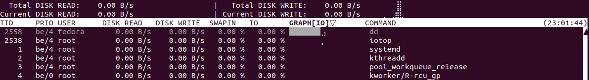

---
&nbsp;

### > iperf3
I decided to use `iperf3` to stress-test the network interface (`enp0s8`) and observe throughput and latency. The baseline metrics were: RX/TX (average of 103.48KB/s), Network Latency (average of 0.06ms), CPU Idle (average of 98.23%) and 1-min Load Average (0.49%) [[14]](/references.md).

The load test consisted of running:
```bash
iperf3 -c 192.168.0.100 
```
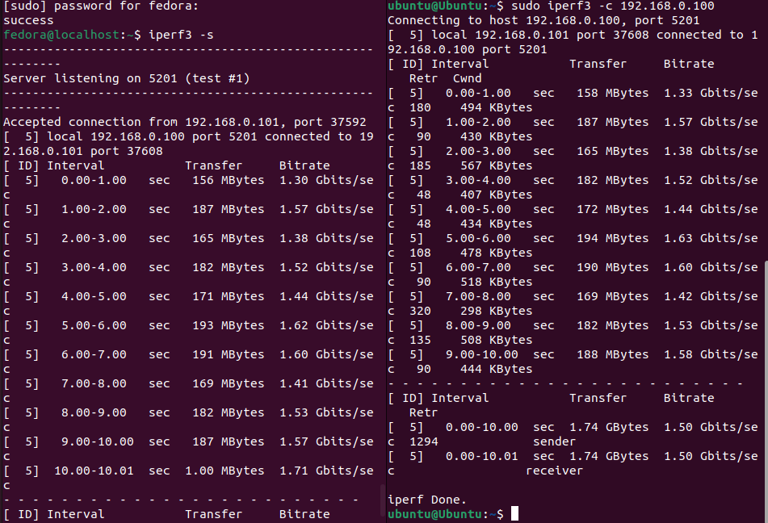
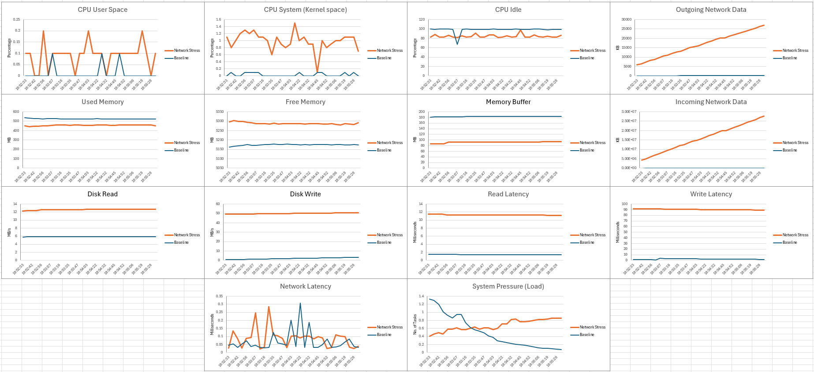

As seen in the monitor output [[14]](/references.md) throughput increased to 5.97GB/s, and latency increased to 0.15ms. CPU idle decreased by 18.73%, confirming the bottleneck is network bandwidth rather than processing power.

The main identified bottleneck was network interface capacity and kernel networking stack limits

&nbsp;

To optimize, I increased TCP buffer sizes to allow larger network data:
```bash
sudo sysctl -w net.core.rmem_max=16777216
sudo sysctl -w net.core.wmem_max=16777216
```


&nbsp;

Re-testing showed throughput improved to 7.64GB/s and latency variance decreased to 0.09ms [[14]](/references.md) - NET Optimisation, leading to more consistent network performance.

&nbsp;

Increasing buffer sizes improves sustained throughput and reduces latency variance. The trade-off is slightly higher memory usage and potential latency spikes during congestion.
> `iperf3 -c 192.168.0.101` visualization in Fedora (server), not used for this specific test.


---
&nbsp;

*Please note that `nice` has been considered as an optimization for each application (except for `iperf3`).*

&nbsp;

### > Closing thoughts

In conclusion, there are a lot of different methods on optimising applications, and, assuming that the ones I chose are on the extreme end of normal applications, I feel better knowing that I will be able to come up with better optimisations for smaller programs when the time comes. I did go through many loops to make the `monitor-server.sh` script work and had to retake many monitoring outputs due to data not recording or corrupted files. One thing is clear, I have now more experience in handling these types of situations, together with a deeper understanding of resource management in Linux.


[//]: # (---)

[//]: # (&nbsp;)

[//]: # (## > Stress Ubuntu &#40;client&#41; CPU, RAM, I/O, Network)

[//]: # ()
[//]: # (> `htop`, `nmon` and `top` with no cpu stress in Ubuntu &#40;client&#41;)

[//]: # ()
[//]: # (![Monitor no load with htop]&#40;../assets/week3/u_def_htop.png&#41;)

[//]: # (![Monitor no load with nmon]&#40;../assets/week3/u_def_nmon.png&#41;)

[//]: # (![Monitor no load with top]&#40;../assets/week3/u_def_top.png&#41;)

[//]: # ()
[//]: # (> `free` and `vmstat` with no cpu stress in Ubuntu &#40;client&#41;)

[//]: # ()
[//]: # (![Monitor no load with free]&#40;../assets/week3/u_def_free.png&#41;)

[//]: # (![Monitor no load with vmstat]&#40;../assets/week3/u_def_vmstat.png&#41;)

[//]: # ()
[//]: # (> `iotop` with no I/O stress in Ubuntu &#40;client&#41;)

[//]: # ()
[//]: # (![Monitor no load with iotop]&#40;../assets/week3/u_def_iotop.png&#41;)

[//]: # ()
[//]: # (&nbsp;)

[//]: # ()
[//]: # (> Run `stress-ng --cpu 3` in Ubuntu &#40;client&#41; and monitor using `htop`, `nmon` and `top` on Fedora &#40;server&#41;)

[//]: # ()
[//]: # (![Run stress-ng --cpu]&#40;../assets/week3/u_stress_cpu.png&#41;)

[//]: # (![Monitor stress-ng --cpu with htop]&#40;../assets/week3/u_stress_cpu_htop.png&#41;)

[//]: # (![Monitor stress-ng --cpu with nmon]&#40;../assets/week3/u_stress_cpu_nmon.png&#41;)

[//]: # (![Monitor stress-ng --cpu with top]&#40;../assets/week3/u_stress_cpu_top.png&#41;)

[//]: # ()
[//]: # (> Run `stress-ng --vm 2 --vm-bytes 1G` in Ubuntu &#40;client&#41; and monitor using `free -h`, `vmstat` and `htop` on Fedora &#40;server&#41;)

[//]: # ()
[//]: # (![Run stress-ng ram]&#40;../assets/week3/u_stress_ram.png&#41;)

[//]: # (![Monitor stress-ng ram with free]&#40;../assets/week3/u_stress_ram_free.png&#41;)

[//]: # (![Monitor stress-ng ram with vmstat]&#40;../assets/week3/u_stress_ram_vmstat.png&#41;)

[//]: # (![Monitor stress-ng ram with htop]&#40;../assets/week3/u_stress_ram_htop.png&#41;)

[//]: # ()
[//]: # (> Run `dd if=/dev/zero of=testfile bs=3G count=2` in Ubuntu &#40;client&#41; and monitor using `iotop` on Fedora &#40;server&#41;)

[//]: # ()
[//]: # (![Monitor stress-ng ram with vmstat]&#40;../assets/week3/u_stress_io_dd.png&#41;)

[//]: # (![Monitor stress-ng ram with htop]&#40;../assets/week3/u_stress_io_iotop.png&#41;)

[//]: # ()
[//]: # (> Run `iperf3 -s` in Ubuntu &#40;client&#41;)

[//]: # ()
[//]: # (![Monitor stress-ng ram with vmstat]&#40;../assets/week3/u_stress_net.png&#41;)

