## Performance Evaluation and Analysis

Execute detailed performance testing and analyse operating system behaviour under different
workloads.
Testing Methodology:
For each application or service, you have chosen, select, monitor and compare the following,
where appropriate:
1. CPU usage
2. Memory usage
3. Disk I/O performance
4. Network performance
5. System latency
6. Service response times.
   Testing Scenarios:
   For each application or service, you have chosen, select, monitor and compare the following,
   where appropriate:
   • Baseline performance testing
   • Application load testing
   • Performance analysis identifying bottlenecks
   • Optimisation testing. Aim to implement and evidence at least two improvements.
   Deliverables (Journal and Video):
1. Document your approach
2. Create a performance data table with structured measurements for all applications and
   metrics
3. Create performance visualisations including charts and graphs
4. Capture testing evidence
5. Conduct network performance analysis documenting latency and throughput
6. Capture optimisation analysis results describing improvements with quantitative data

---
&nbsp;
## > Stress Fedora (server) CPU, RAM, I/O, Network

> `htop`, `nmon` and `top` with no cpu stress in Fedora (server)

> `free` and `vmstat` with no cpu stress in Fedora (server)

> `iotop` with no I/O stress in Fedora (server)

&nbsp;

> Run `stress-ng --cpu 3` in Fedora (server) and monitor using `htop`, `nmon` and `top` on Ubuntu (client)

> Run `stress-ng --vm 2 --vm-bytes 1G` in Fedora (server) and monitor using `free -h`, `vmstat` and `htop` on Ubuntu (client)

> Run `dd if=/dev/zero of=testfile bs=3G count=2` in Fedora (server) and monitor using `iotop` on Ubuntu (client)

> Run `iperf3 -c 192.168.0.101` in Fedora (server)

---
&nbsp;
## > Stress Ubuntu (client) CPU, RAM, I/O, Network

> `htop`, `nmon` and `top` with no cpu stress in Ubuntu (client)

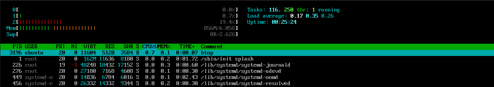
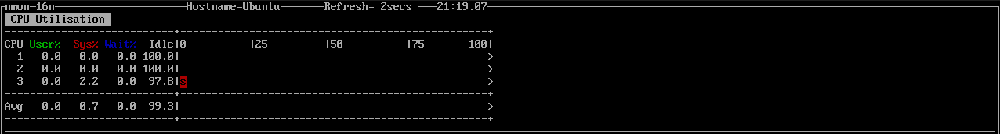
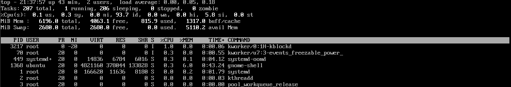

> `free` and `vmstat` with no cpu stress in Ubuntu (client)

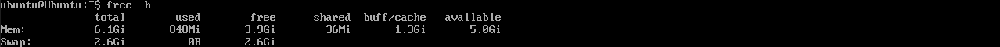
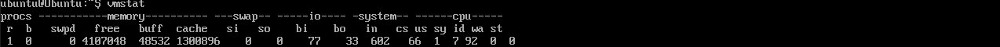

> `iotop` with no I/O stress in Ubuntu (client)

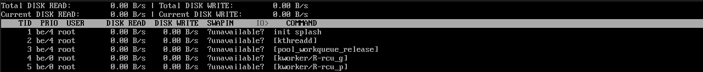

&nbsp;

> Run `stress-ng --cpu 3` in Ubuntu (client) and monitor using `htop`, `nmon` and `top` on Fedora (server)

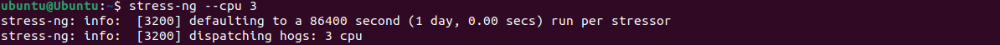
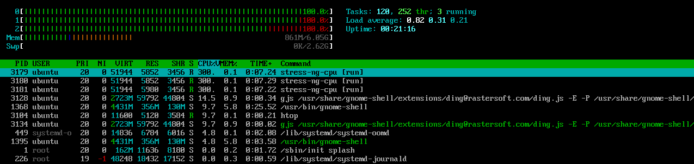
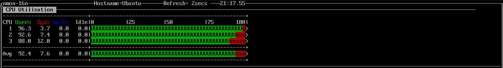
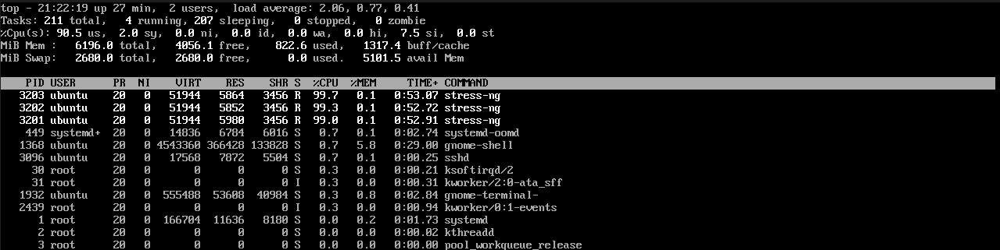

> Run `stress-ng --vm 2 --vm-bytes 1G` in Ubuntu (client) and monitor using `free -h`, `vmstat` and `htop` on Fedora (server)

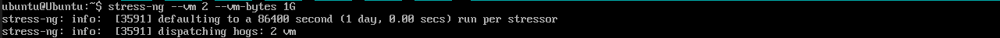
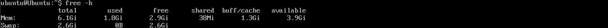
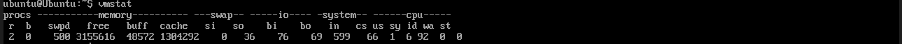
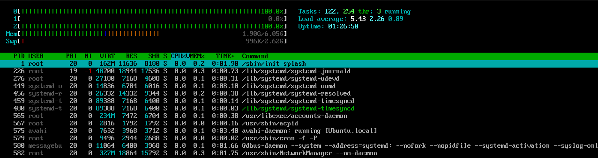

> Run `dd if=/dev/zero of=testfile bs=3G count=2` in Ubuntu (client) and monitor using `iotop` on Fedora (server)

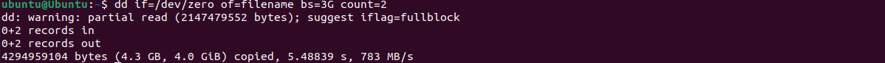
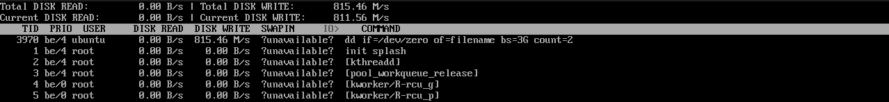

> Run `iperf3 -s` in Ubuntu (client)

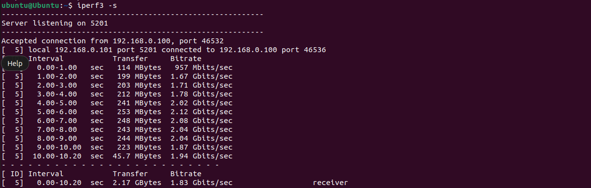

