## Security Audit and System Evaluation
The goal for this phase was to conduct a comprehensive security audit and evaluate the overall system configuration. The focus was on identifying vulnerabilities, verifying access control, reviewing running services, and assessing remaining risks.

&nbsp;

> The mandatory tasks included:

&nbsp;

### > Security scanning using Lynis
The system was scanned with `Lynis`, a host-based security auditing tool. The command executed [[16]](/references.md) was:

```bash
sudo lynis audit system --quick
```

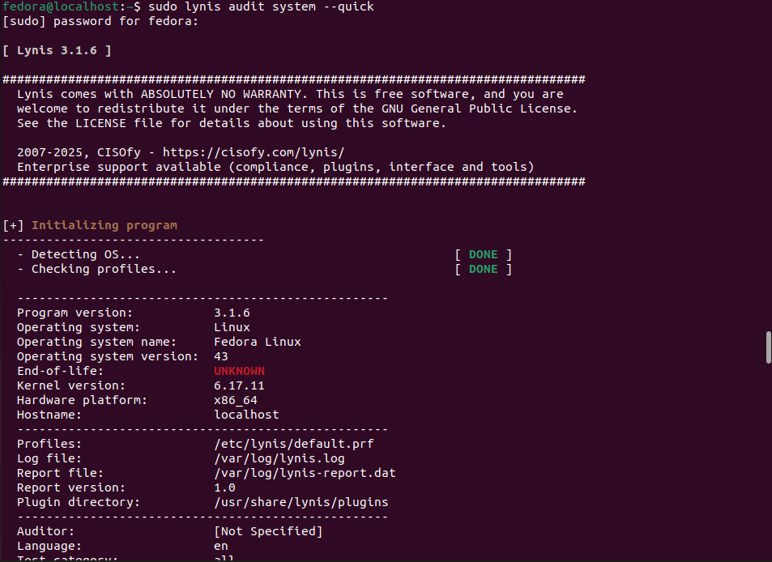

The `Lynis` score before remediation was 66/100, showing moderate compliance with many potential security issues [[16]](/references.md).


The baseline audit showed one Warning and 34 Suggestions:

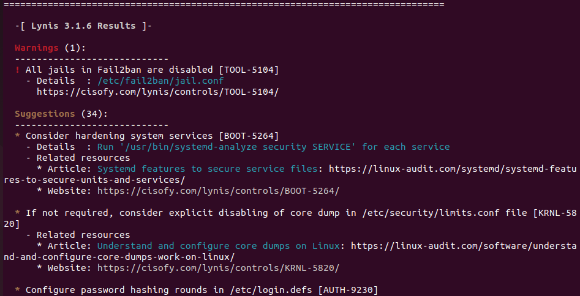

The main waring specified that fail2ban jail was disabled. To enable it, I created the file `/etc/fail2ban/jail.local` and added `enabled=true` to both *sshd* and *proftpd*. This action bumped the score to 68/100.

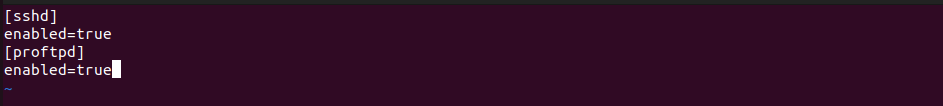

I added a malware scanner as suggested, installing rkhunter.
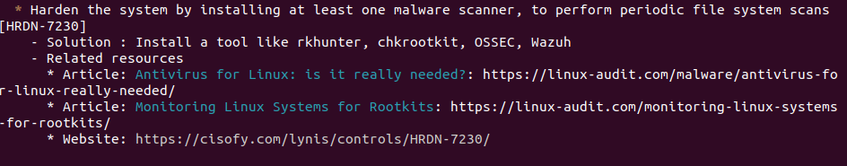

Blacklist unused protocols:
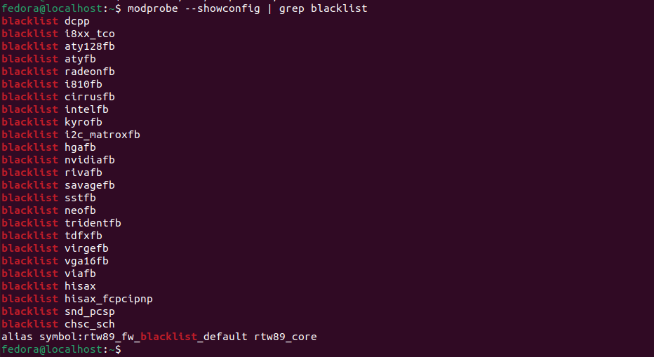

Extra SSH Hardening
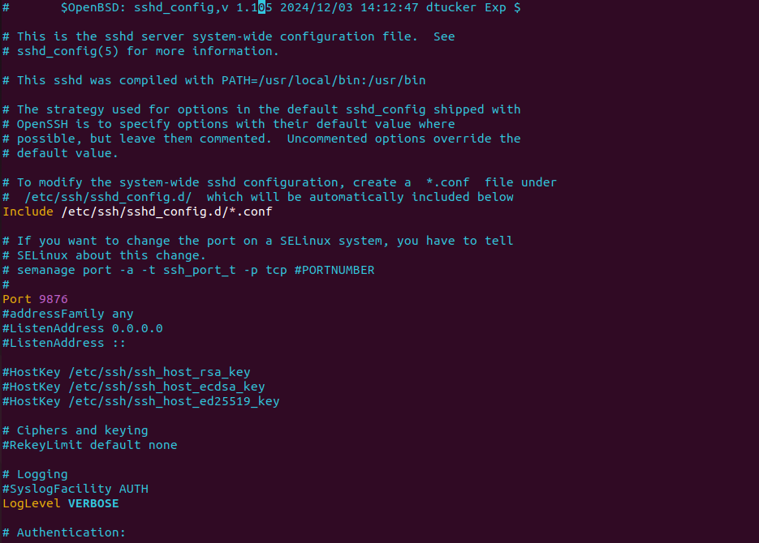
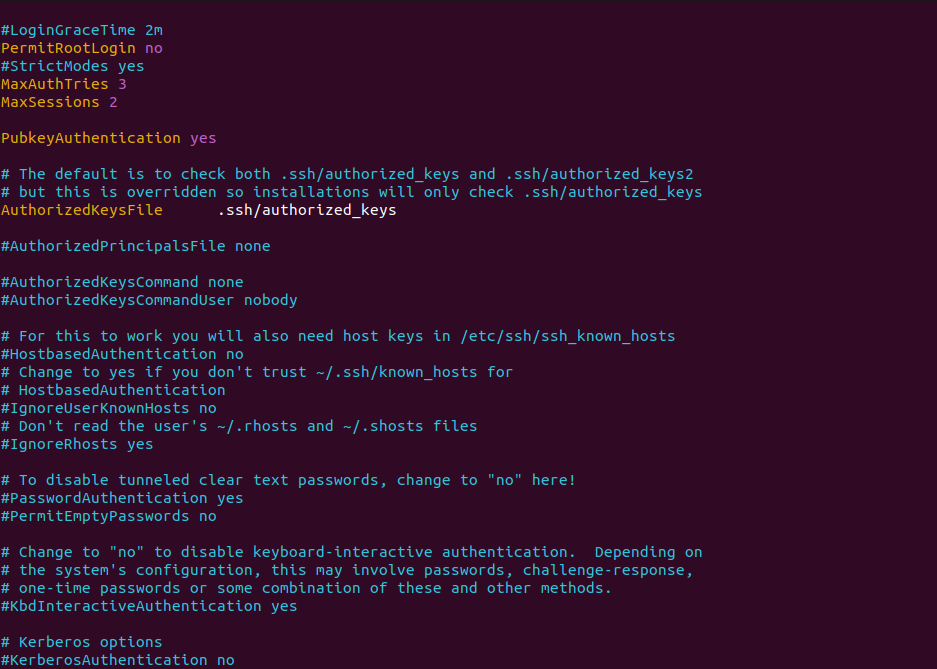
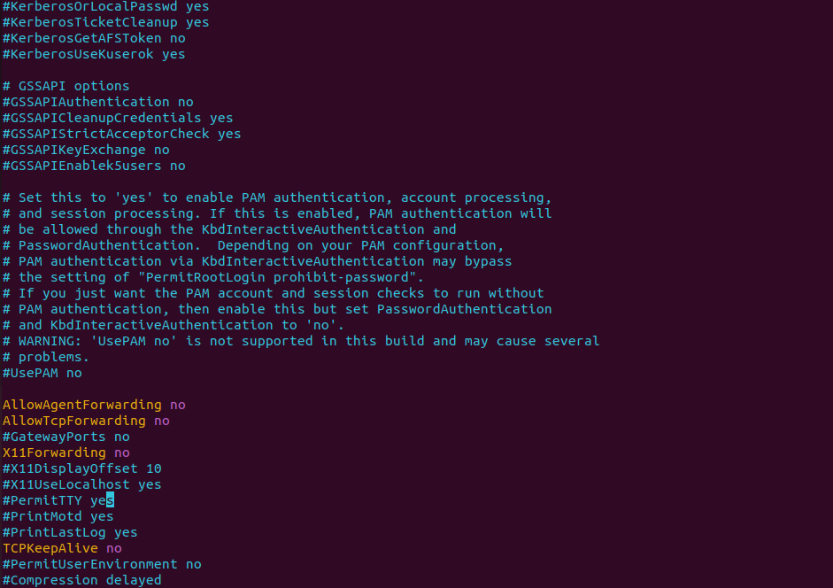
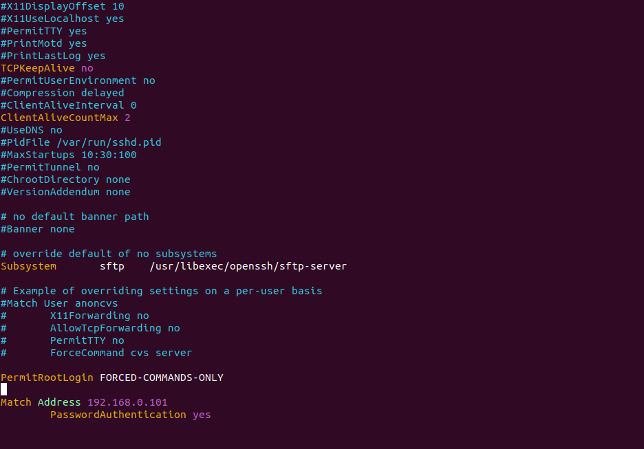

Finally, after following some of the suggestions, I received a score of 83/100, while being left with 20 suggestions. There is still room for improvement, and I believe that the system can be secured up to 90%+, but the coursework requires a Lynis score of more than 80% and adding more security features might hinder my Journey. In conclusion, disabling services improved security but slightly reduced system convenience.


---
&nbsp;

### > Network security assessment using nmap
After hardening the system using suggestions from Lynis, I focused on assessing the network security, focusing on identifying open ports, services, and potential vulnerabilities.

```bash
sudo nmap -sS -sV 192.168.0.100
```


By running `nmap`, I detected only one open port (9876) with OpenSSH 8.9 and nginx 1.24. I was able to detect that the OS had Linux Kernel 6.x . I was not able to detect any known critical vulnerabilities in the scanned services.

> No more optimisations were needed due to Linyx network hardening.

---
&nbsp;

### > Verification of access control policies
I checked access control to follow the `principle of least privilege` [[17]](/references.md) and to reduce the impact of potential credential compromise. The audit focused on user accounts, authentication mechanisms, privilege escalation, and auditing.

All user accounts were enumerated using:

```bash
getent passwd
```
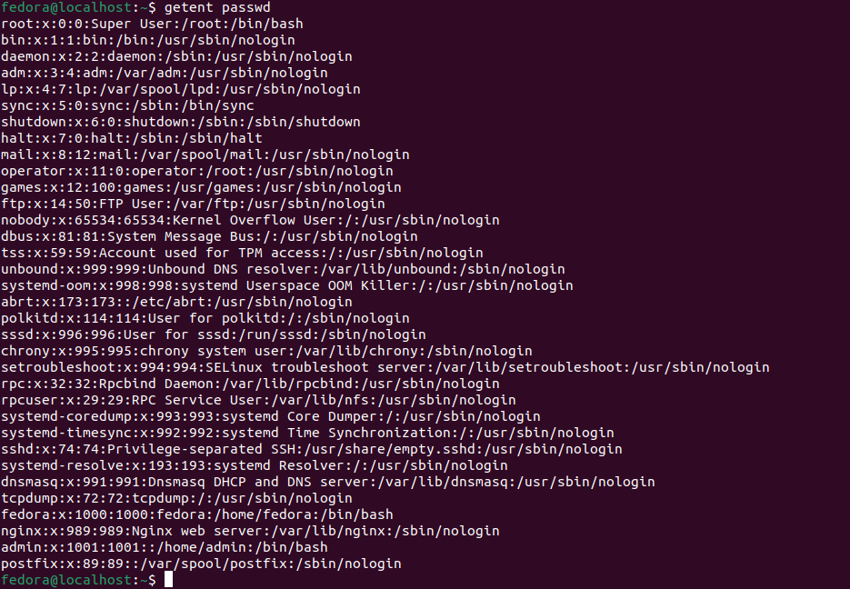

Only two non-root administrative users were present and assigned to the `wheel group` (*/bin/bash*). Admin has been added as a coursework requirement, and fedora is the default non-root account created in the OS setup. Direct root logins were disabled to prevent privilege escalation through credential compromise.

The `sudo` configuration was verified using:

```bash
sudo -l
```

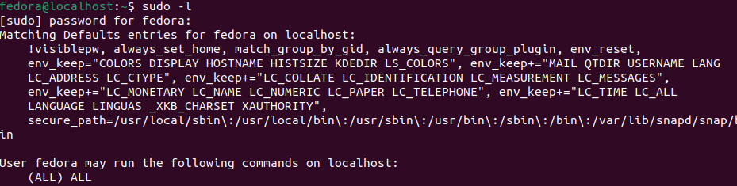

> This confirmed that administrative actions required explicit authentication and were logged.

Password authentication for SSH was disabled in favour of key-based authentication in */etc/ssh/sshd_config*, eliminating brute-force password attacks and credential stuffing risks. Additionally, I enforced password policies via PAM, changing the minimum password length character complexity password reuse restrictions and account lockout mechanisms to mitigate brute-force attempts (all suggested by Linys).

All these changes introduced administrative slowness, as tasks that previously required minimal effort now require authenticated sudo access and properly configured SSH keys.

---
&nbsp;

### > Service audit and justification of all running services

Below you may find a list of all services to identify unnecessary or potentially vulnerable services that could increase the attack surface using:
```bash
systemctl list-units --type=service --state=running
```
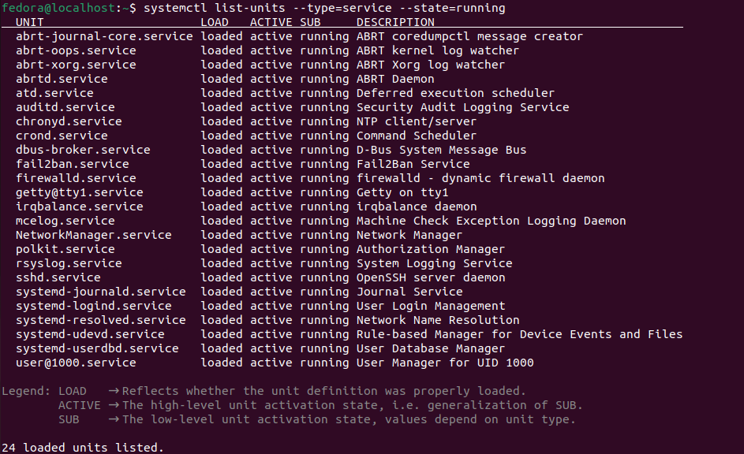

| Service Name                | Description                                | Security Relevance | Action / Justification                                    |
| --------------------------- | ------------------------------------------ |--------------------|-----------------------------------------------------------|
| `abrt-journal-core.service` | Creates crash reports from systemd journal | Medium             | Useful for post-incident diagnostics and system stability |
| `abrt-oops.service`         | Monitors kernel oops messages              | Medium             | Aids in detecting kernel-level faults and instability     |
| `abrt-xorg.service`         | Monitors Xorg crashes                      | Low                | Crash monitor                                             |
| `abrtd.service`             | ABRT core daemon                           | Medium             | Supports crash detection and forensic analysis            |
| `atd.service`               | Deferred task scheduler                    | Low                | Lightweight and useful for scheduled background jobs      |
| `auditd.service`            | Security auditing and event logging        | High               | Critical for security auditing and compliance             |
| `chronyd.service`           | Network time synchronization               | Medium             | Accurate time is essential for logs and security analysis |
| `crond.service`             | Scheduled task execution                   | Medium             | Required for maintenance and security jobs                |
| `dbus-broker.service`       | System message bus                         | Low                | Core OS dependency                                        |
| `fail2ban.service`          | Intrusion prevention via log analysis      | High               | Mitigates brute-force SSH attacks                         |
| `firewalld.service`         | Dynamic firewall management                | High               | Enforces network security rules                           |
| `getty@tty1.service`        | Local console login                        | Low                | Used for local login                                      |
| `irqbalance.service`        | Distributes interrupts across CPU cores    | Low                | Improves system performance                               |
| `mcelog.service`            | Logs hardware machine check errors         | Low                | Aids in hardware fault detection                          |
| `NetworkManager.service`    | Network configuration management           | Medium             | Required for network connectivity                         |
| `polkit.service`            | Authorization framework                    | Medium             | Controls privilege escalation                             |
| `rsyslog.service`           | System log aggregation                     | High               | Critical for logging and auditing                         |
| `sshd.service`              | Secure remote access                       | High               | Essential for administration                              |
| `systemd-journald.service`  | Collects system logs                       | High               | Core logging infrastructure                               |
| `systemd-logind.service`    | User session management                    | Medium             | Required for login handling                               |
| `systemd-resolved.service`  | DNS resolution                             | Medium             | Required for network operations                           |
| `systemd-udevd.service`     | Device event management                    | Medium             | Core OS component                                         |
| `systemd-userdbd.service`   | User database service                      | Low                | Core OS component                                         |
| `user@1000.service`         | Per-user systemd manager                   | Low                | Required for user session processes                       |

All unnecessary services were disabled in the Lynis phase mentioned above. Disabling services removes functionality that could be useful in desktop or development environments, such as network discovery or printing. For server environments, removing non-essential services is a net security gain with minimal operational impact.

---
&nbsp;

### > System configuration review and optimisation

Overall, you may find all actions taken to secure and optimise a fedora server:

- I exposed only SSH (port 9876) restricted by only the client IP, blocking all other inbound traffic [week 2](/week2.md). 
- I disabled password authentication and root login through SSH
- I changed password policies to only accept long password with expiration
- I reviewed Kernel parameters (Lynis suggestion)
- I enabled audit logging (auditd) to track security events.
- I optimised CPU, RAM, I/O, Network and Latency metrics from applications meant to stress each metric and checked results using quantitative data.

---
&nbsp;

### > Closing thoughts

This week helped me understand how effective each action taken in week 2 improved system hardening. Linys humbled me showing all possible vulnerabilities in the fedora server and I learned a lot following each suggestion. At first, the log looked quite daunting, with many lines stating each test and suggestion, but after focusing on one suggestion, I was able to increase the score one by one making the hardening process less tedious.